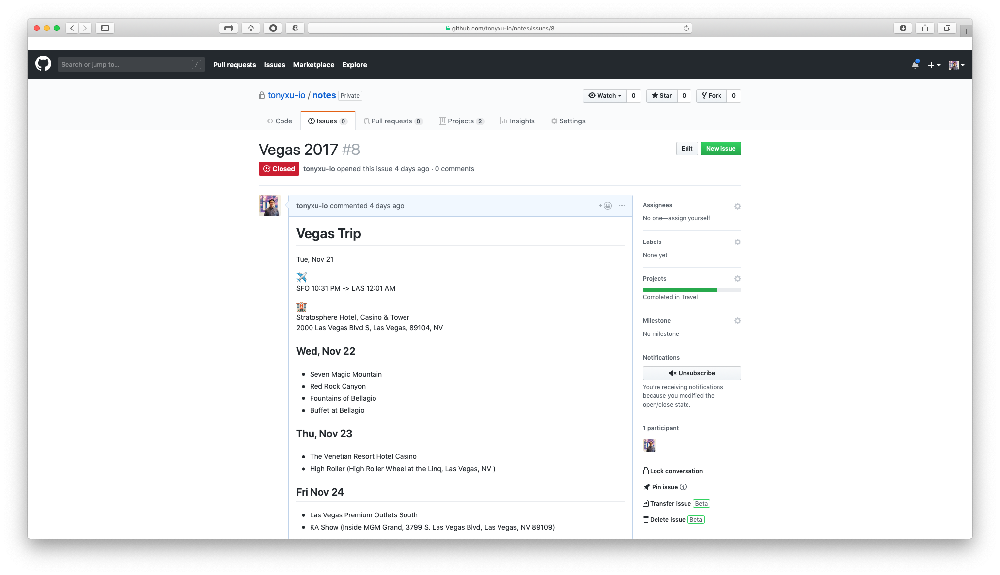

# Use GitHub for Knowledge Base Management and Projects Management

GitHub has become the one and only platform for developers. We collaborate on the platform for anything about code. Can GitHub help you anything else besides code? I have recently been frustrated choosing a tool to manage my personal knowledge base, although there are lots of choices such as note apps (Bear, Evernote), project management app (Trello), or knowledge management app (Notion.so), eventually GitHub turned out to my choice which has below pros:

- It support Markdown
- It allows you to manage small piece of notes as well as long-form articles
- It supports kanban flow
- It integrate with your daily work

Have you ever thought about using it to manage your personal knowledge base? Let me explain how I use it to manage my personal knowledge base.

| GitHub Feature | Usage                                |
| -------------- | ------------------------------------ |
| Issues         | Store unstructural markdown articles |
| Projects       | Organized kanban view                |
| Wiki           | Store structural knowledge base      |

## Examples

### GitHub Issues

GitHub Issues allow you to create markdown article. Images pasted in the comment will automatically get uploaded and inserted as markdown image. Issues can also be added tags, or added to projects where you can organize a kanban view. I persoanlly use GitHub issues to create long articles and referenced in project card where I have a more organized view.

### GitHub Projects

GitHub Projects is the main place where I manage my projects and knowledge. For example, I created a "Work Log" project and organize my work tasks using columns and cards.

You can easily filter/search cards inside projects, or move cards between columns. You can design a kanban flow for the columns, or simply use it as lists.

### GitHub Wiki

I don't personally use GitHub Wiki given that it's limited functionality. It doesn't natively support child wiki pages and you have to manually define nested table of contents. But if you really need a multi-page markdown document, GitHub Wiki can do the job.
